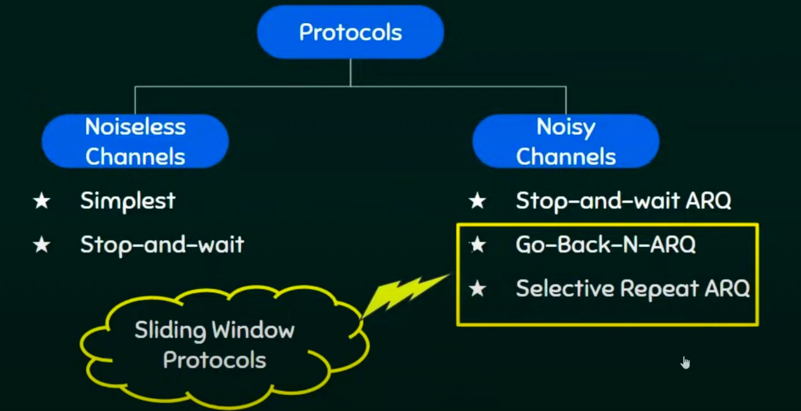
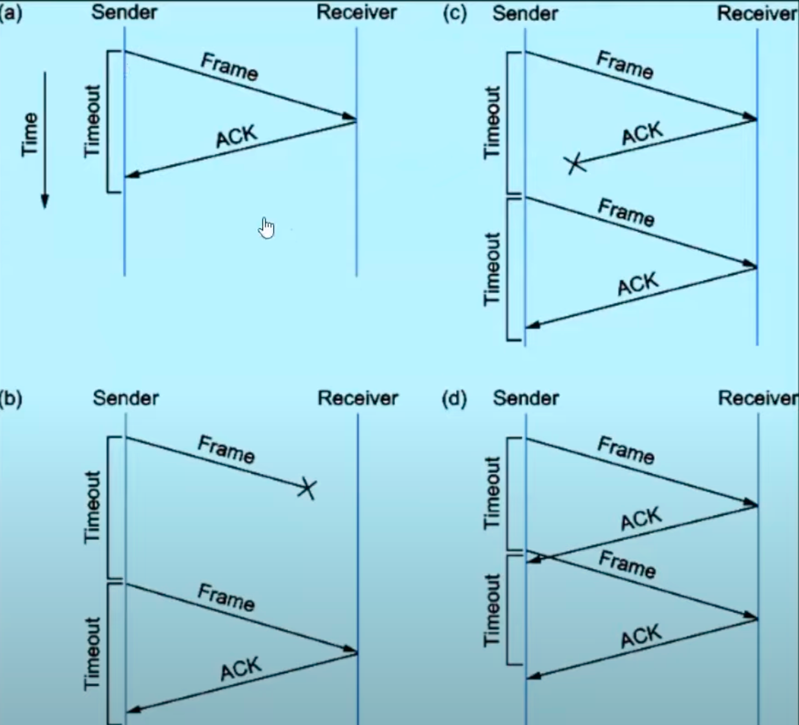
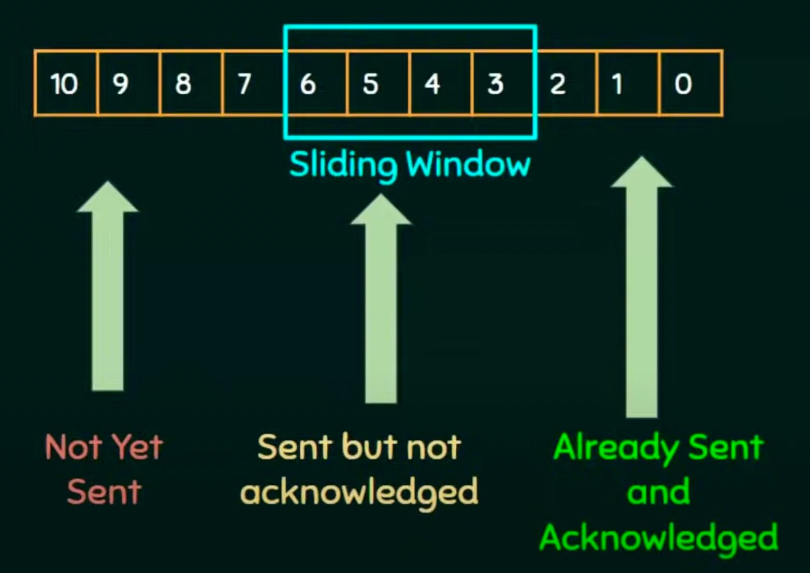
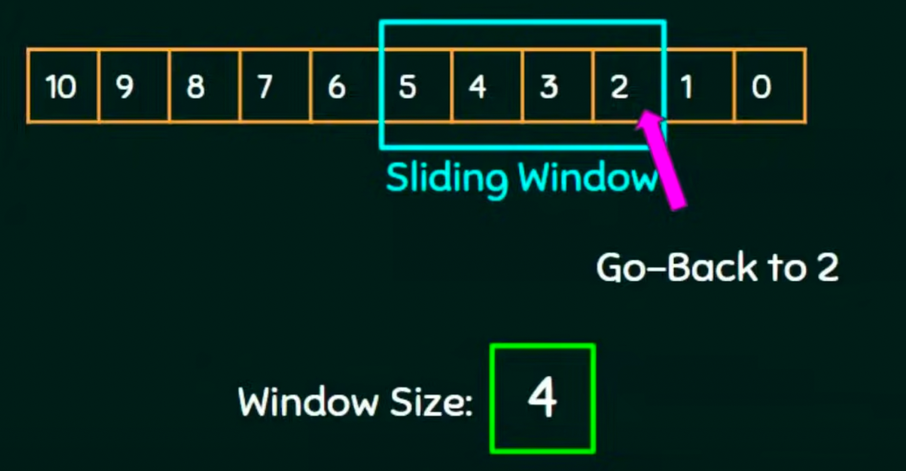

# Flow Control  

- Speed matching mechanism.  
- Flow control coordinates(协调) the amount of data that can be sent before receiving an acknowledgement  
- Flow control is a set of procedures(程序) that tells the sender how much data it can transmit before is must wait for an acknowledgement from the receiver.  
- Receiver has a limited speed at which it can process incoming data and a limited amount of memory in which to store incoming data.  
- Receiver must inform the sender before the limits are reached and request that the transmitter to send fewer frames or stop temporarily.  

## Protocols : 

  

1. Noiseless Channels 
   1. Simplest Protocol
   2. Stop-and-wait Protocol
      1. Stop-and-Wait protocol is data link layer protocol for transmission of frames over noiseless channels.  
      2. It provides unidirectional data transmission with flow control facilities but without error control facilities.  
         1. Unidirectional data transmission means that either sending or receiving will take place at a time, both sending and receiving  will not happen at a time.  
      3. The idea of stop-and-wait protocol is straightforward.  
      4. After transmitting one frame, the sender waits for an acknowledgement before transmitting the next frame.  
      5. Primitive of stop-and-wait protocol  
         1. Sender side:  
            1. send one data packet at a time  
            2. Send the next packet only after receiving ACK for the previous.  
         2. Receiver side
            1. Receive and consume data packet.  
            2. After consuming packet, ACK need to be sent(Flow Control)   
       1. Problems of stop-and -wait protocol  
           1. Problems due to last data.  
              Sender waits for ACK for an infinite amount of time.  
              Receiver waits for data an infinite amount of time.  
           2.  Problems due to lost ACK.  
             Sender waits for an infinite amount of time for ACK.   
           3. Problem due to delayed ACK/data  
           After timeout on sender side, a delayed ACK might be wrong considered as ACK of some other data packet.   

2. Noisy Channels
   1. Stop-and-wait ARQ(stands for automatic repeat request) Protocol  
   Idea of stop-and-wait protocol is straightforward.  
   After transmitting one frame, the sender waits for an acknowledge before transmitting the next frame  
   If the acknowledgement does not arrive after a certain period of tome, the sender times out and retransmits the original frame.  
   $$ Stop And Wait ARQ = Stop And Wait + Timeout Timer + Sequence Number$$  
     

   Drawbacks:  
   One frame at a time.    
   Poor utilization.  
   1. Sliding Window Protocol   
   Send multiple frames at a time.  
   Number of frames to be sent is based on **Window size**  
   Each frame is numbered->Sequence number.  
     
     

      1. Go-Back-N-ARQ   
   'N' is the sender window size.  
   Go-Back-N ARQ uses the concept of protocol pipelining(流水线) i.e. the sender can send multiple frames before receiving the acknowledgment for the first frame.  
   There are finite number of frames and the frames are numbered in a sequential manner(顺序方式).  
   The number of frames that can be sent depends on the window size of the sender.  
   If the acknowledgement of a frame is not received within an agreed upon time period, all frames in the current window are retransmitted.  

   N - Sender's Window Size.  
   For example, if the sending window size is $2^2$, then the sequence numbers will be 0,1,2,3,0,1,2,3,0,1,2,3,0,1...  
   The number of bits in the sequence number is 2 to generate the binary sequence 00,01,10,11.  
     

      2. Selective Repeat ARQ    
   In Selective Repeat ARQ, only the erroneous or lost frames are retransmitted, while correct frames are receiver and buffered.  
   The receiver while keeping track of sequence numbers, buffers the frames in memory and sends NACK for only frame which is missing or damaged.  
   The sender will send/retransmit packet for which NACK is received.  
     
   

