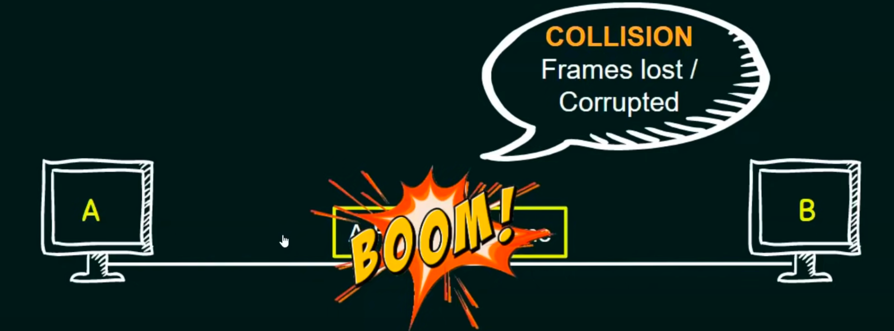
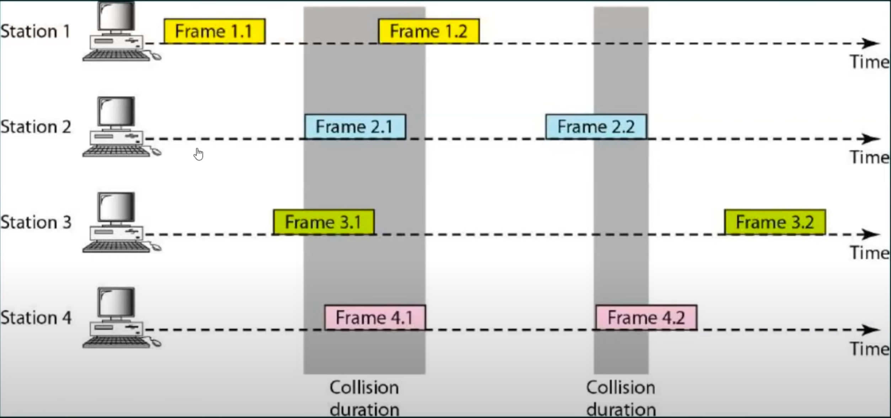
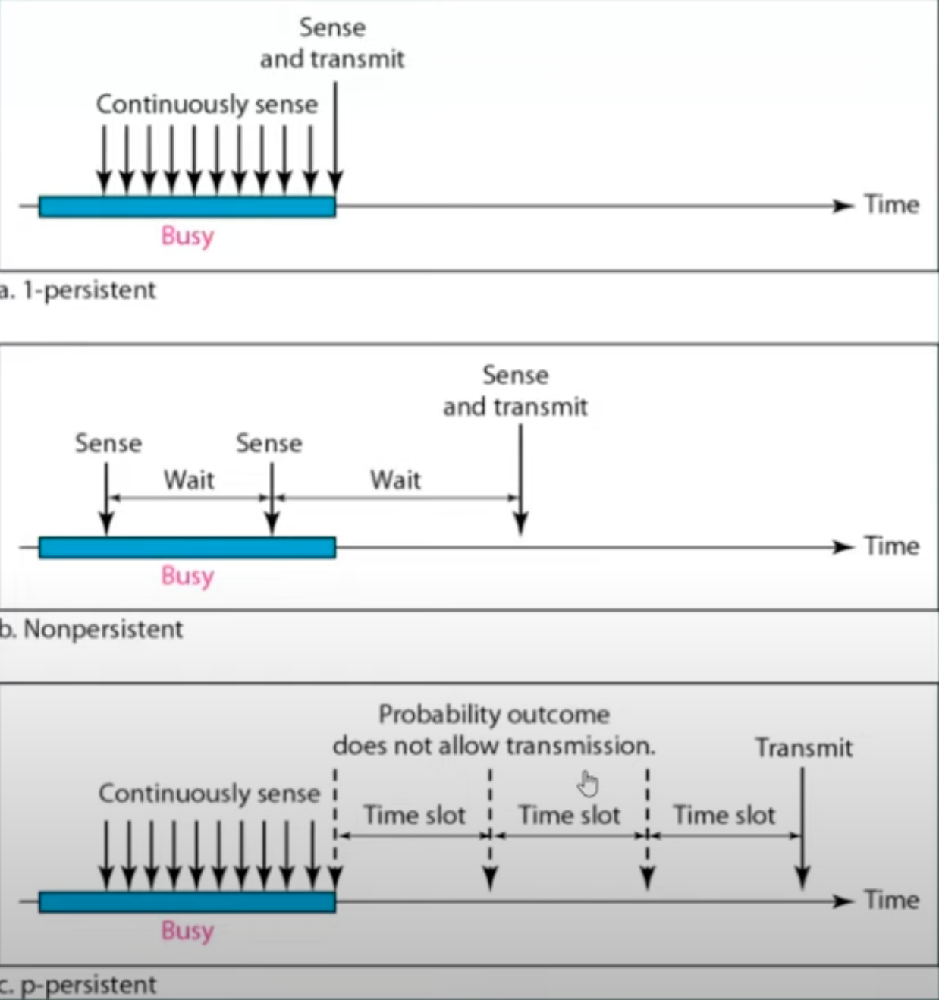
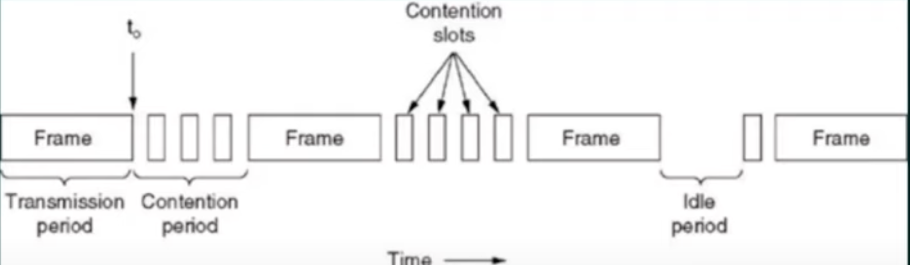

# Multiple Access Protocols  
- Is a Data link layer(MAC) protocol.  
Data link layer has two sublayer: LLC(logic link control), MAC(media access control)  

If there is a dedicated(专用的) link between the sender and the receiver then data link control layer is sufficient,such as Point-to-Point topology(Mesh topology). However if there is no dedicated link present then multiple stations can access the channel simultaneously(同时),such as Bus topology.    

Hence multiple access protocol are required to decrease collision(冲突，碰撞) and avoid crosstalk(串话).  
## Category of multiple access protocol  
- Multiple-access protocols  
  - Random access protocols  
    - **ALOHA**  
      - **Pure Aloha**
      - **slot Aloha**
    - CSMA  
    - CSMA/CD  
    - CDMA/CA  
  - Controlled-access protocols  
    - Reservation  
    - Polling  
    - Token passing    
  - Channelization protocols  
    - FDMA  
    - TDMA
    - CDMA  

## Random Access Protocols  
Random means all nodes(stations) have right to transmit frame at any time.  

In this, all stations have same superiority(地位) that is no station has more priority than another stations. Any station can send data depending on medium's state(idle or busy).  

In a Random access method, each station has the right to the medium without being controlled by any other station.  

If more than one station tries to send, there is an access conflict(Collision) and the frames will be either destroyed or modified.  

To avoid access conflict, each station follows a procedure(步骤).  
1. When can the station access the medium ?  
2. What can the station do if the medium is busy ?
3. How can the station determine the success or failure of the transmission ?  
4. What can the station do if there is an access conflict ?

## Controlled Access Protocols  

In controlled access, the stations consult one another to find which station has the right to send.  
A station cannot send unless it has been authorized(授权) by other stations.  

## Channelization Protocols  

Channelization is a multiple-access method in which the available bandwidth of a link is shared in time, frequency(频率), or through code, between different stations.    

## ALOHA  
Aloha is a random access protocol.  
It was actually designed for WLAN(Wireless LAN) but it is also applicable for shared medium.  
In this, multiple stations can transmit data at the same time and can hence lead to collision and data being garbled(乱码).  

Type: 
- **Pure Aloha**  
- Slotted Aloha  

Collision:  
  

### Pure Aloha  
  
**Pure ALOHA allows stations to transmit whenever they have data to be sent.**  
When a station sends data it waits for an acknowledgement.   
If the acknowledgement doesn't come within the allotted(已分配) time then the station waits for a **random** amount of time called **back-off time(Tb)** and re-sends the data.    
Since different stations wait for different amount time, the probability of further collision decreases.  
The throughput of pure aloha is maximized when frames are of uniform length(fixed size frame).  

Whenever two frames try to occupy the channel at the same time, there will be a collision and both will be garbled.  
If the first bit of a new frame overlaps(重叠) with just the last bit of a frame almost finished, both frames will be totally destroyed and both will have to be retransmitted later.  
  

$Vulnerable  Time = 2*T$  
$Throughput = G*e^{-2G}$ Where G is the number of stations wish to transmit in the same time.  
Maximum Throughput = 0.184 for G = 0.5  
  
When we have half station in this transmission time, we will get the Maximum throughput.  

## CSMA Protocol  
- CSMA stands for Carrier Sense Multiple Access.     

Carrier means the channel or the medium  
- To minimize the chance of collision and, therefore, increase the performance, the CSMA method was developed.  
- Principle of CSMA:"Sense before transmit" or "Listen before talk"  
- Carrier busy = Transmission is taking place.  
- Carrier idle = No transmission currently taking place.  
- The possibility of collision still exists because of propagation(延迟) delay; a station may sense the medium and find it idle, only because the first bit sent by another station has not yet been received.  

### Types of CSMA  
1. 1-Persistent CSMA  
2. P-Persistent CSMA  
3. Non-Persistent CSMA  
4. *O-Persistent CSMA  
The main concept in CSMA has 2 variations(变体):   
CSMA/CD(CSMA with modification Collision Detection)  
CSMA/CA(CSMA with modification Collision Avoidance)  

### 1-Persistent CSMA  
Since the station transmits the frame with the probability of 1 when the carrier or channel is idle, this scheme of CSMA is called as 1-Persistent CSMA.  
Before sending the data, the station first listens to the channel to see id anyone else is transmitting the data at that moment.  
If the channel is idle, the station transmits a frame.  
In the worse condition, if node A is communicating with node D, it means frames are transmitting on the channel, node B, node C, and node E wants transmit frame. So these node will continuously sense channel. When channel is free node B,C,D,E will immediately send frame. Collision will happen. So the probability of collision is high in this condition.  
**If busy, then it senses the transmission medium continuously until it becomes idle.**  
The propagation delay has an important effect on the performance of the protocol.  
The longer the propagation delay, the more important this effect becomes, and worse the performance of protocol.  

### Non-Persistent CSMA(0-Persistent CSMA)
Before sending, a station sense the channel, if no one else is sending(The channel is idle), the station begins doing so it self.  
However, if the channel is already in use, the station does not continually sense it for the purpose of seizing(抓住) it immediately upon detecting the end of the previous transmission.(然而，如果该信道已经在使用中，则该站不会为了在检测到先前传输结束时立即抓住它而不断地感知它。)  
Instead, it waits a random period of time and then repeats the algorithm. Consequently, this algorithm leads to better channel utilization but longer delays than 1-Persistent CSMA.  
If Node A wants transmit and senses channel is busy, then Node A sets it timer that I am waiting for 30 seconds or 30 minutes. It is possible that your channel becomes free after next second. So the delay will be high.  
### P-persistent CSMA  
P here is the probability value.  
This is a hybrid approach.  
If P is 0, then it becomes 0-Persistent, if P is 1 it becomes 1-persistent.  
Concept of WIFI generally uses P-persistent.  
It applies to slotted channels.  
When a station becomes ready to send, it senses the channel continuously.  
If it is idle, it transmits with a probability P.  
With a probability Q=1-p, it defers(推迟) until the next slot.  
If that slot is also idle, it either transmits or defers again, with probabilities P and Q.  
This process is repeated until either the frame has been transmitted or another station has begun transmitting.  
If the station initially senses the channel busy, it waits until the next slot and applies the above algorithm.  
  

### CSMA/CD
If two station sense the channel to be idle and begin transmitting simultaneously. they will both detect the collision almost immediately.  
Rather than finish transmitting their frames, which are irretrievably(无法挽回的) garbled anyway, they should abruptly(突然地) stop transmitting as soon as the collision is detected.  
Quickly terminating damaged frames saves time and bandwidth.  
This protocol, known as CSMA/CD(CSMA with Collision Detection) is widely used on LANs in the MAC sublayer.  
Access method used by Ethernet:CSMA/CD.  
    
At the point marked t0, a station has finished transmitting its frame.  
Any other station having a frame to send may now attempt to do so, if two or more stations decide to transmit simultaneously, there will be a collision.  
Collision can be detected by looking at the power(energy) or pulse width of the received signal and comparing it to the transmitted signal.  
If Collision occur double energy signal will be detected.  

After a station detects a collision, it aborts(中止) its transmission, waits a random period of time, and then tries again, assuming that no other station has started transmitting in the meantime.(在此期间)    
Therefore, model for CSMA/CD will consist of alternating contention(交替的争用) and trans mission periods, with idle periods(空闲周期) occurring when all stations are quiet.   

#### CSMA/CD - FOR GATE ASPIRANTS  
$$Efficiency = 1/1+6.44*a$$  
$$ a = Tp/Tt$$  
*Tt stands for Transmission time*    
*Tp stands for Propagation time*  
$$tp = distance/bandwidth$$  
- If distance increase, efficiency of CSMA decreases.  
So CSMA is not suitable for long distance networks like WAN; but works optimally(最佳) for LAN.  
- If length of packet is bigger, the efficiency of CSMA also increase; but maximum limit for length is 1500 Bytes.  
- Transmission Time >= Round Trip of 1 bit.  
- Transmission Time >= 2*Propagation time.  

### CSMA/CA  
Carrier-sense multiple access with collision avoidance(CSMA/CA) is a network multiple access method in which carrier sensing is used, but nodes attempt to avoid collision by beginning transmission only after the channel is sensed to be "idle".  

It is particularly important for wireless networks, where the collision detection of the alternative(可代替的) is not possible due to wireless transmitters(无线发射器) sensing their receivers during packet transmission is poorly.    
In WLAN, energy fading with transmitting, which is the reason CSMA/CD is not suitable for WLAN.  

CSMA/CA is unreliable due to the hidden node problem(隐藏节点问题) and exposed terminal problem(暴露终端问题).    
Solution: RTS/CTS exchange.  
*RTS stands for Ready to send message*  

#### Numerical Question on CSMA/CD  
Consider a CSMA/CD network that transmits data at a rate of 100Mbps($10^8$bits per second) over 1 Km cable with no repeaters. If the minimum frame size required for this network is 1250 bytes. What is the signal speed(Km/sec) in the cable?  

$$Tt >= 2*Tp$$  
$$Tt = L/bandwidth$$  
$$Tp = Distance/V$$  
$$L/bandwidth = 2*Distance/V$$ 
 ->  $$V = 2*bandwidth * Distance/L$$  
-> $$V = 2*100 *10^6 * 1/(1250 * 8) = 20000Km/sec$$

